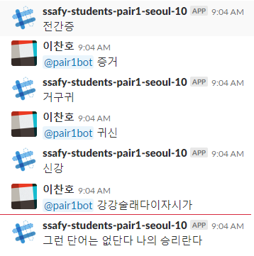

# ChatBot - EndtoEnd Game

## Images

## feature
* 끝말잇기 챗봇

## How to Use
* EndToEnd.py 파일로 작동한다.
* 슬랙에서 "@봇이름 단어" 형식으로 입력하면 봇이 그 단어에 대한 다음 단어를 이야기 한다.
* 이상한 단어를 입력하거나 사전에 없는 단어를 입력하면 사용자에게 패배를 알린다.
* 다음 단어로 시작하는 단어가 없을 시 봇이 "내가졌다"고 패배를 선언한다.
* 이 외에 이전에 했던 것이라던지, 그런 디테일한 케이스는 구현하지 않았다.

## developer
* 이찬호
* 정우성
* 윤주영